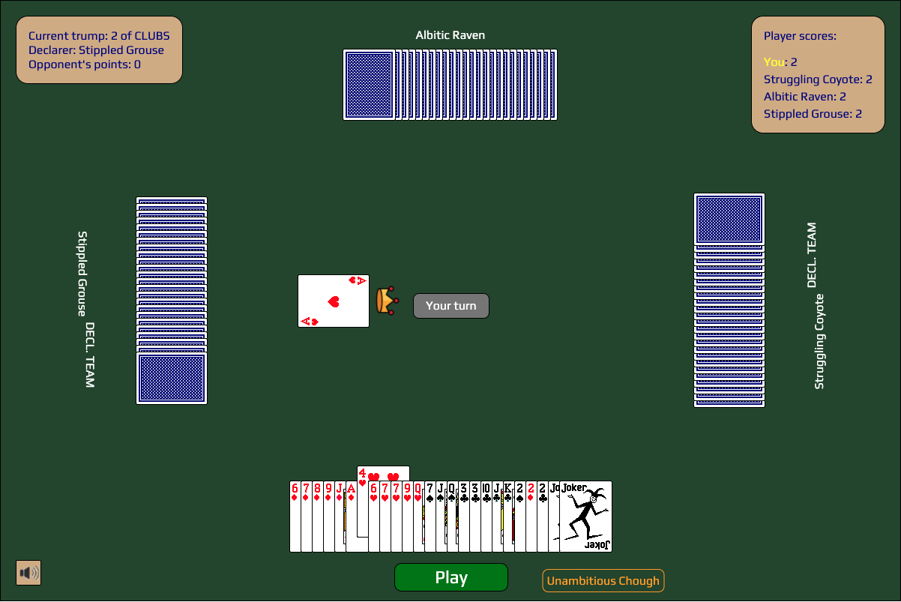

# Tractor (拖拉机)

Multiplayer online tractor game. Try it at https://orange-tractor.herokuapp.com/.

### Features:

- Engine implements the full ruleset and allows only valid plays
- Supports variable number of players and variable number of decks
- Supports find-a-friend version
- Supports leading with a set of top cards (special "does it fly" plays)
- Supports take-backs
- Sound notifications on your turn
- Shows the currently winning player in each trick
- View the most recent trick
- Automatic card drawing during the draw phase
- AI players

## Quickstart

    npm install
    npm run build
    ./gradlew run

Go to http://localhost:8080.

## Development

### Backend

The backend is a Java Dropwizard server. The files are in the standard Gradle Java layout, with production files in `src/main/java`. Assets are served from `src/main/resources/assets`. The in-game communications are JSON-serialized messages sent to and received from clients via websocket using the Atmosphere framework.

Run either `./gradlew eclipse` or `./gradlew idea` to setup the project in Eclipse or IntelliJ (respectively), and then run the entry point, `TractorServer.java`.

### Frontend

The frontend is a single-page React app in plain Javascript. The assets live in `client/assets`, self-contained React components live in `client/components`, library code (no React) live in `client/lib`, and the top-level view components live in `client/views`.

To start the dev server, run:

    npm install
    npm run start

Then go to http://localhost:3000. The site will auto-refresh after making any frontend changes.

